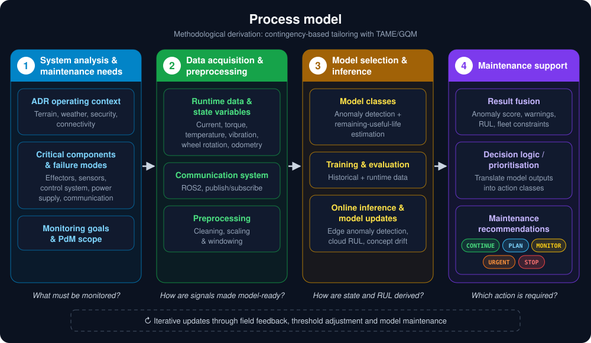
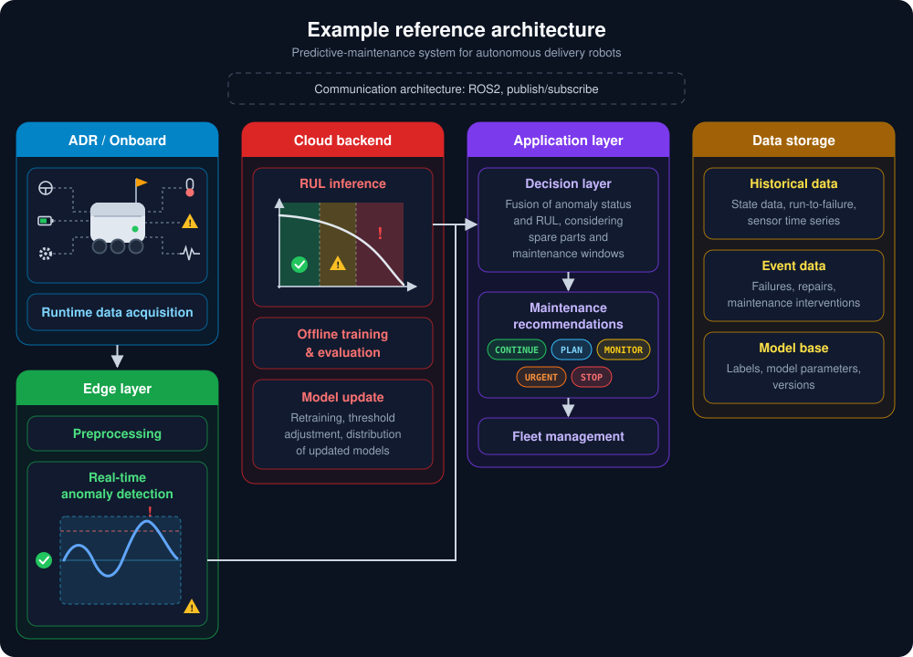

<div align="center">


# Sensor data in. Maintenance decision out.

**The architecture from my bachelor's thesis, built end to end: detection on the edge, prognostics in the cloud, and a decision layer that turns both into one call:<br>`CONTINUE`, `MONITOR`, `PLAN`, `URGENT` or `STOP`.**

<a href="https://github.com/lucazagaia/Predictive-Maintenance/actions/workflows/ci.yml"></a>
<a href="../../releases/tag/v1.0.0"></a>


<a href="LICENSE"></a>

<table>
<tr>
<td align="center" width="33%"><h3>4 design fields</h3>one process model, from system analysis to maintenance decision<br><sub>thesis Chapter 4</sub></td>
<td align="center" width="33%"><h3>Edge + cloud</h3>detection on the robot, prognostics in the backend<br><sub>typed messages over named topics</sub></td>
<td align="center" width="33%"><h3>1 decision layer</h3>two model outputs become one of five actions<br><sub>12-cell matrix, safety before planning</sub></td>
</tr>
</table>

Implements the architecture from my **TU Berlin bachelor's thesis** (graded 1.3) · Models are swappable reference components from **[Brockmann et al. 2023](https://arxiv.org/abs/2311.04765)** and **Li et al. 2018** · Layer contracts pinned by tests on every push

**[See it work](#see-it-work) · [The contribution](#the-contribution) · [Process model](#the-process-model) · [Reference architecture](#the-reference-architecture) · [How a decision is made](#how-a-decision-is-made) · [Quickstart](#quickstart) · [Roadmap](#roadmap)**

</div>

---

## See it work

Two windows of real robot data go in. Two very different calls come out.

<table>
<tr>
<th width="50%">🟢 Healthy operation</th>
<th width="50%">🔴 Degraded / fault</th>
</tr>
<tr>
<td valign="top">

```text
/robot/state       temp=72.0 vib=0.2
                   torq=12.0 curr=9.5
[edge]  detection  healthy
[cloud] RUL        47 cycles (urgent)
[cloud] decision   schedule_maintenance_soon
```

> 📅 **PLAN**: schedule maintenance within the window

</td>
<td valign="top">

```text
/robot/state       temp=88.0 vib=1.1
                   torq=28.0 curr=14.5
[edge]  detection  anomaly
[cloud] RUL        0 cycles (immediate)
[cloud] decision   stop_and_inspect
```

> ⛔ **STOP**: halt the robot and inspect immediately

</td>
</tr>
</table>

**The robot is fine now but running out of life, so plan ahead. The robot is faulting, so stop, whatever the RUL says.**

<sub>Trimmed from <code>python run_demo.py</code>. Detection windows are real voraus-AD samples; the ADR readings are hand-set proxies (see <a href="#data">Data</a>).</sub>

## The contribution

My bachelor's thesis (TU Berlin, graded **1.3**) asked how a predictive-maintenance system for autonomous last-mile delivery robots should be designed. Its answer is an architecture, not an algorithm:

- a **process model** of four design fields, from system analysis to a maintenance recommendation, derived by tailoring predictive-maintenance practice from industrial robotics to the delivery-robot context (Chapters 3 and 4);
- an **example reference architecture** that shows how those fields become running components across robot, edge, cloud, application and data layers (Figure 2).

The thesis describes its own contribution as "less algorithmic than architectural in nature" (§5.1). It was validated conceptually; no prototype was built (§5.2).

**This repository builds it.** The architecture, the message contracts between its layers and the decision layer are the work here. The two models are published methods, plugged in as the reference components the thesis selects (§4.3.1). Each sits behind a message contract, so either can be replaced without touching the other layers.

<sub>Thesis: <em>A process model for designing a predictive-maintenance system for deploying autonomous delivery robots on the last mile</em> (TU Berlin, 2026). It is written in German; this README cites it by section, figure and table number, which are the same in either language.</sub>

## The process model

<p align="center">
  
</p>
<p align="center"><sub>Thesis Figure 1, redrawn in English.</sub></p>

Each design field answers one question, and each has a home in this repository:

| # | Design field | Question it answers | Thesis | In this repo |
|:-:|---|---|:-:|---|
| 1 | System analysis & maintenance needs | *What must be monitored?* | §4.1 | Conceptual. Fixes the proprioceptive channels `StateMsg` carries: temperature, vibration, torque, current |
| 2 | Data acquisition & preprocessing | *How are signals made model-ready?* | §4.2 | `src/messages.py` (state message, topics) · `scripts/train_*.py` (feature selection, scaling, windowing) · the training-time scaling reused at runtime |
| 3 | Model selection & inference | *How are state and RUL derived?* | §4.3 | `src/edge.py` (detection) · `src/cloud.py` (RUL) · `scripts/` (offline training, threshold calibration) |
| 4 | Maintenance support | *Which action is required?* | §4.4 | `src/fusion.py` (decision matrix) · operator messages in `src/cloud.py` |

## The reference architecture

<p align="center">
  
</p>
<p align="center"><sub>Thesis Figure 2, redrawn in English. The recommendations follow the decision matrix in Table 1, which adds <code>URGENT</code>.</sub></p>

The thesis presents this as one possible build, not the only one. V1 builds its runtime path end to end; the layers around it are staged across versions:

| Layer | Component | V1 | Where |
|---|---|:-:|---|
| ADR / onboard | Runtime data acquisition | ✅ | `StateMsg` built from the committed samples in `data/samples/` |
| Edge layer | Preprocessing | ✅ | the training-time scaler, `models/scaler_voraus_ad.pkl` |
| | Real-time anomaly detection | ✅ | `EdgeNode` → `src/detection.py` |
| Cloud backend | RUL inference | ✅ | `CloudNode` → `src/prediction.py` |
| | Offline training & evaluation | ✅ | `scripts/`, `notebooks/` |
| | Model update | 🟡 | Manual: rerun a trainer or `scripts/calibrate_detection.py`. No automated loop |
| Application layer | Decision layer | ✅ | `src/fusion.py`: the technical core, anomaly status × RUL class |
| | Maintenance recommendations | ✅ | Five actions, each with an operator message |
| | Fleet management | 📋 | V3 |
| Data storage | Model base | 🟡 | `models/`: weights, scalers, thresholds. No versioning |
| | Historical & event data | 📋 | Not yet. Training reads the public datasets directly |
| Communication | ROS2 publish/subscribe | 🟡 | V1: typed messages over named topics, in one process. V2: real ROS2 nodes on [`feat/ros2`](../../tree/feat/ros2) |

<sub>✅ built in V1 · 🟡 partly · 📋 planned</sub>

## How a decision is made

<p align="center">
  
</p>

One `StateMsg` from the robot becomes one `DecisionMsg` for the operator:

1. **The robot publishes its state** on `/robot/state`: four proprioceptive channels plus the detection window, under a header with a timestamp and the robot id, modelled on the thesis's `state.msg` (Figure 3).
2. **The edge scores the window and sorts it into three states.** Two thresholds split the anomaly score into `healthy`, `warning` and `anomaly`. The warning band between them is deliberate: it keeps the robot's short-term state from collapsing into a hard yes/no (§4.4.3). Both thresholds are calibrated on normal operation only (Tukey fences over 400 normal windows), because a fleet without labelled faults has nothing else to calibrate on.
3. **The cloud estimates remaining useful life and sorts it into four urgency classes**: `immediate` under 25 cycles, `urgent` under 50, `soon` under 90, `planned` beyond. The cutoffs scale with the model's 125-cycle range and stand in until they can be tied to real maintenance lead times (§4.4.3).
4. **The decision layer fuses both** into one action and publishes it, with an operator message, on `/decision`.

### The decision matrix

| Status ↓ · RUL urgency → | immediate | urgent | soon | planned |
|---|:---:|:---:|:---:|:---:|
| **anomaly** | 🟥 `STOP` | 🟥 `STOP` | 🟥 `STOP` | 🟥 `STOP` |
| **warning** | 🟧 `URGENT` | 🟧 `URGENT` | 🟨 `MONITOR` | 🟨 `MONITOR` |
| **healthy** | 🟦 `PLAN` | 🟦 `PLAN` | 🟩 `CONTINUE` | 🟩 `CONTINUE` |

This is the thesis's decision matrix (§4.4.3, Table 1), cell for cell. A live anomaly dominates and forces `STOP` whatever the RUL says. A healthy robot with little life left gets planned maintenance, not an alarm. All 12 cells are pinned by [`tests/test_decision_matrix.py`](tests/test_decision_matrix.py).

| Action | Meaning (§4.4.3) |
|---|---|
| 🟥 `STOP` | Interrupt operation now: safe return or recovery |
| 🟧 `URGENT` | High-priority inspection or intervention within the current operating horizon |
| 🟨 `MONITOR` | Keep operating, with heightened monitoring and alert readiness |
| 🟦 `PLAN` | Schedule a preventive action into the next executable maintenance window |
| 🟩 `CONTINUE` | Nothing beyond routine operation |

<details>
<summary><strong>Topics and messages</strong></summary>

<br>

| Topic | Message (`src/messages.py`) | Publisher | Payload |
|---|---|---|---|
| `/robot/state` | `StateMsg` | robot | 4 ADR channels + detection window |
| `/edge/detection` | `DetectionMsg` | `EdgeNode` | status, confidence, anomaly score |
| `/cloud/prediction` | `PredictionMsg` | `CloudNode` | RUL cycles, urgency, maintenance window |
| `/decision` | `DecisionMsg` | `CloudNode` | action, priority, operator message |

Every message carries the source robot's id, so a fleet can tell its robots apart; [`tests/test_contracts.py`](tests/test_contracts.py) checks that it survives every hop. Component rationale: [`docs/architecture.md`](docs/architecture.md).

</details>

## Design decisions

| Decision | Why | Thesis |
|---|---|:-:|
| **Treat predictive maintenance as one system, not a model choice** | Data, models and decisions are designed as one chain. The models are components inside it | §3.1.2, §5.1 |
| **Detect on the edge, predict in the cloud** | A fault must be able to stop the robot without a cloud round-trip. RUL, retraining and fleet aggregation tolerate latency | §4.3.3 |
| **Typed messages over publish/subscribe topics** | Producers and consumers stay decoupled, so components can change and robots can be added without redesigning the whole | §4.2.3 |
| **Learn detection from normal data only** | Labelled fault data from delivery robots does not exist publicly. A density model of normal operation needs none | §4.3.1 |
| **Three states, not two** | A warning band between healthy and anomaly absorbs borderline cases instead of forcing a hard yes/no | §4.4.3 |
| **A rule-based decision layer, safety first** | A small matrix is auditable and explainable to an operator, and lets a live anomaly override any RUL estimate | §4.4.2, §4.4.3 |

## Quickstart

```bash
python3 -m venv .venv && source .venv/bin/activate
pip install -r requirements.txt
python run_demo.py
```

Python 3.10 to 3.13. Both trained models are committed, so it runs fully real out of the box: no dataset download, no training, no GPU. If a weight file is ever missing, detection falls back to a clearly labelled synthetic scorer and RUL to a placeholder, so the demo always completes.

```bash
pytest   # decision matrix, layer contracts, and the end-to-end path
```

<details>
<summary><strong>Retrain from raw data</strong>: C-MAPSS and voraus-AD, one command each</summary>

<br>

```bash
# RUL: Li et al. CNN on C-MAPSS FD001 (~5-10 min, CPU is fine)
python scripts/train_rul.py --cmapss-dir /path/to/CMAPSSData
#   → models/rul_cnn.pt + models/normalization_stats.json

# Detection: MVT-Flow on the voraus-AD parquet (GPU recommended)
python scripts/train_mvtflow.py --parquet /path/to/voraus-ad-dataset-100hz.parquet
#   → models/mvt_flow_voraus_ad.pt + scaler_voraus_ad.pkl + voraus_thresholds.json
```

[`notebooks/`](notebooks/README.md) has the same two runs broken into readable stages, with the paper citations attached. The detection notebook is Colab-ready for a free GPU: [](https://colab.research.google.com/github/lucazagaia/Predictive-Maintenance/blob/main/notebooks/detection_01_mvt_flow_training.ipynb)

</details>

## Reference models

Both models are published methods, reimplemented as the reference components the thesis selects (§4.3.1). They are not the contribution: the rest of the pipeline only depends on the anomaly score and the RUL they hand on.

| Layer | Reference model | Why the thesis selects it | Paper |
|---|---|---|---|
| Edge | **MVT-Flow** normalizing flow | Density-based, trains on normal data only, built for multivariate time series | Brockmann, Rudolph, Rosenhahn & Wandt (2023), *The voraus-AD Dataset for Anomaly Detection in Robot Applications*, [arXiv:2311.04765](https://arxiv.org/abs/2311.04765) |
| Cloud | **Li et al. 1-D CNN** | Data-driven, reads windowed multivariate sensor series directly, no hand-crafted features | Li, Ding & Sun (2018), *Remaining useful life estimation in prognostics using deep convolution neural networks*, Reliability Engineering & System Safety 172, 1–11 |

The notebooks cite both papers by section, table and page for every hyperparameter and label each deviation. For example, the RUL model takes 17 features: the paper's 14 sensors plus the 3 operational settings.

<details>
<summary><strong>Model checks</strong>: do the reimplementations behave like their papers?</summary>

<br>

These numbers measure the borrowed models, not the architecture. Single runs with default settings, reported as measured:

| Check | Result | Paper |
|---|---|---|
| Detection AUROC, held-out 400 normal / 400 anomaly windows | **0.949** | 0.936 (mean of 9 runs) |
| Anomaly windows that cross the anomaly threshold | 54% | |
| Anomaly windows flagged `warning` or above | 73% | |
| False alarms on normal windows (`warning` or above) | 3.0% | |
| RUL test RMSE, C-MAPSS FD001 official labels | **17.5** | ≈ 12.6 (tuned) |

Three real C-MAPSS test windows, scored with no proxy involved, predict 9.9, 72.1 and 120.1 cycles against true values of 7, 87 and 145.

[`tests/test_pipeline.py`](tests/test_pipeline.py) checks the detection figures and the C-MAPSS windows against the committed artifacts. The RMSE needs the full C-MAPSS test set, so `scripts/train_rul.py` reproduces it.

</details>

## Data

Stated plainly, because it matters for reading the results:

| Stage | Trained on | What it is | What it is not |
|---|---|---|---|
| Detection | **voraus-AD** | *Real* robot anomaly data: 130 signals, 6-axis pick-and-place manipulator | Delivery-robot data |
| Prediction | **NASA C-MAPSS FD001** | Turbofan run-to-failure data, the standard RUL benchmark | Robot data |
| ADR → RUL bridge | **Hand-built proxy** in `src/prediction.py` | A deliberate stand-in that maps 4 ADR channels onto C-MAPSS features | A learned or physically calibrated mapping |

**Why proxy data?** As the thesis discusses, a public run-to-failure dataset from real autonomous-delivery-robot sensor streams **does not yet exist**. That is a field-wide limitation, not a shortcut specific to this project. The architecture is validated on the closest public proxies, and retraining on real ADR degradation data is the natural next step once such data exists.

<details>
<summary><strong>Repository layout</strong>, by architecture layer</summary>

<br>

```
Predictive-Maintenance/
├── run_demo.py              # ← the entry point: one command, full runtime path
├── src/
│   ├── messages.py          # communication: typed messages + topic names
│   ├── edge.py              # edge layer: the detection node
│   ├── detection.py         #   score → healthy / warning / anomaly
│   ├── cloud.py             # cloud backend + application layer: RUL node, decision
│   ├── prediction.py        #   RUL → urgency class + maintenance window
│   ├── fusion.py            # decision layer: the decision matrix
│   ├── mvt_flow_model.py    # reference model: MVT-Flow network (PyTorch)
│   └── rul_model.py         # reference model: Li et al. CNN (PyTorch)
├── scripts/                 # offline training + threshold calibration
├── models/                  # model base: weights, scalers, thresholds (committed)
├── data/samples/            # demo inputs: ADR readings, real C-MAPSS + voraus windows
├── tests/                   # decision matrix, layer contracts, end-to-end path
├── notebooks/               # the training runs, stage by stage
└── docs/                    # architecture notes + the diagrams in this README
```

`src/` is the runtime library and depends on nothing in `scripts/`. `scripts/` is build tooling that produces the artifacts `src/` loads.

</details>

## Limitations

What V1 does not cover yet, measured against the architecture it implements:

| Gap | What it means |
|---|---|
| **Technical decision core only** | The decision layer fuses the runtime and prognosis streams. The operational stream the thesis designs (maintenance windows, spare parts, lead times, costs; §4.4.2) is not built yet |
| **No data storage or update loop** | Historical and event data, automated retraining, threshold adjustment and drift handling belong to the architecture but not to V1 |
| **One process, one robot** | Topics are modelled in-process. Real transport is V2, a fleet view V3 |
| **Proxy data** | voraus-AD (robot arm) and C-MAPSS (turbofan) stand in for delivery-robot data, and the ADR → C-MAPSS mapping is hand-built. `StateMsg` carries 4 of the 6 channels in the thesis's `state.msg`: no battery state of charge or wheel speed yet |
| **Thresholds and RUL bands are not ADR-calibrated** | Both come from the proxy datasets and must be re-derived from real ADR data and maintenance lead times (§4.3.2, §4.4.3) |
| **No real-time or production hardening** | Latency is untested. No input validation for malformed sensor data, no monitoring, no model versioning or serving |
| **RUL confidence is a placeholder** | The CNN is a point estimate. The reported confidence is a constant, not calibrated uncertainty |

## Roadmap

`main` is V1. Each later version builds out one more part of the reference architecture, on its own branch.

| Version | Builds out | Status |
|---|---|---|
| **V1: runtime path** | Edge detection, cloud RUL and the technical decision core, in one process | ✅ [Released](../../releases/tag/v1.0.0) |
| **V2: communication layer** | Real ROS2 Humble nodes (rclpy), custom `.msg` interfaces, DDS transport with QoS set per topic, in a container | 🚧 In progress on [`feat/ros2`](../../tree/feat/ros2) |
| **V3: application layer** | Multiple robots, decision history and an operator-facing fleet health view | 📋 Planned |
| **Beyond** | The operational input stream, data storage with an update loop for drift, real ADR degradation data, uncertainty-aware RUL | 💭 Ideas |

## License

[MIT](LICENSE). The referenced papers and the thesis are not part of this repository and remain with their respective authors and publishers.

## Cite

GitHub's **Cite this repository** button uses [`CITATION.cff`](CITATION.cff). Or:

```bibtex
@software{zagaia2026predictive,
  author  = {Zagaia, Luca},
  title   = {Predictive Maintenance for Autonomous Delivery Robots: Reference Architecture and Pipeline},
  year    = {2026},
  version = {1.0.0},
  url     = {https://github.com/lucazagaia/Predictive-Maintenance}
}
```

---

<div align="center">

🤖 **Designed in a thesis. Built end to end. Checked on every push.**

<sub>
<a href="docs/architecture.md">Architecture notes</a> ·
<a href="notebooks/README.md">Notebooks</a> ·
<a href="../../releases">Releases</a> ·
<a href="../../tree/feat/ros2">ROS2 branch</a> ·
<a href="../../issues">Issues</a>
</sub>

</div>
