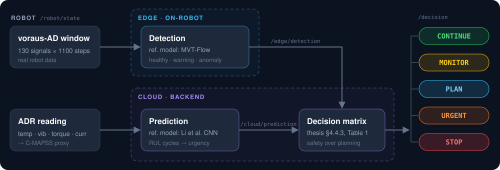

<div align="center">


# Sensor data in. Maintenance decision out.

**Two trained models and a decision matrix turn a delivery robot's sensor stream into one call:<br>`CONTINUE`, `MONITOR`, `PLAN`, `URGENT` or `STOP`.**

<a href="https://github.com/lucazagaia/Predictive-Maintenance/actions/workflows/ci.yml"></a>
<a href="../../releases/tag/v1.0.0"></a>


<a href="LICENSE"></a>
<a href="https://colab.research.google.com/github/lucazagaia/Predictive-Maintenance/blob/main/notebooks/detection_01_mvt_flow_training.ipynb"></a>

<table>
<tr>
<td align="center" width="33%"><h3>0.949 AUROC</h3>anomaly detection on real robot data<br><sub>voraus-AD, 400 normal / 400 anomaly windows</sub></td>
<td align="center" width="33%"><h3>17.5 RMSE</h3>remaining useful life, in cycles<br><sub>NASA C-MAPSS FD001, official test labels</sub></td>
<td align="center" width="33%"><h3>3.0% false alarms</h3>on normal operation<br><sub>while 73% of faults reach <code>warning</code> or above</sub></td>
</tr>
</table>

Implements the process model from my **TU Berlin bachelor's thesis** (graded 1.3) · Reimplements **[Brockmann et al. 2023](https://arxiv.org/abs/2311.04765)** and **Li et al. 2018** · Reported numbers pinned by tests on every push

**[See it work](#see-it-work) · [Quickstart](#quickstart) · [How it works](#how-it-works) · [Results](#results) · [Thesis alignment](#alignment-with-the-thesis) · [Limitations](#limitations) · [Roadmap](#roadmap)**

</div>

---

## See it work

Two windows of real robot data go in. Two very different calls come out.

<table>
<tr>
<th width="50%">🟢 Healthy operation</th>
<th width="50%">🔴 Degraded / fault</th>
</tr>
<tr>
<td valign="top">

```text
/robot/state       temp=72.0 vib=0.2
                   torq=12.0 curr=9.5
[edge]  detection  healthy
[cloud] RUL        47 cycles (urgent)
[cloud] decision   schedule_maintenance_soon
```

> 📅 **PLAN**: schedule maintenance within the window

</td>
<td valign="top">

```text
/robot/state       temp=88.0 vib=1.1
                   torq=28.0 curr=14.5
[edge]  detection  anomaly
[cloud] RUL        0 cycles (immediate)
[cloud] decision   stop_and_inspect
```

> ⛔ **STOP**: halt the robot and inspect immediately

</td>
</tr>
</table>

**The robot is fine now but running out of life, so plan ahead. The robot is faulting, so stop, whatever the RUL says.**

<sub>Trimmed from <code>python run_demo.py</code>. Detection windows are real voraus-AD samples; the ADR readings are hand-set proxies (see <a href="#data">Data</a>).</sub>

## Quickstart

```bash
python3 -m venv .venv && source .venv/bin/activate
pip install -r requirements.txt
python run_demo.py
```

Python 3.10 to 3.13. Both trained models are committed, so it runs fully real out of the box: no dataset download, no training, no GPU. If a weight file is ever missing, detection falls back to a clearly labelled synthetic scorer and RUL to a placeholder, so the demo always completes.

```bash
pytest   # decision matrix cell by cell, plus the end-to-end numbers quoted in this README
```

<details>
<summary><strong>Retrain from raw data</strong>: C-MAPSS and voraus-AD, one command each</summary>

<br>

```bash
# RUL: Li et al. CNN on C-MAPSS FD001 (~5-10 min, CPU is fine)
python scripts/train_rul.py --cmapss-dir /path/to/CMAPSSData
#   → models/rul_cnn.pt + models/normalization_stats.json

# Detection: MVT-Flow on the voraus-AD parquet (GPU recommended)
python scripts/train_mvtflow.py --parquet /path/to/voraus-ad-dataset-100hz.parquet
#   → models/mvt_flow_voraus_ad.pt + scaler_voraus_ad.pkl + voraus_thresholds.json
```

[`notebooks/`](notebooks/README.md) has the same two runs broken into readable stages, with the paper citations attached. The detection notebook is Colab-ready for a free GPU: [](https://colab.research.google.com/github/lucazagaia/Predictive-Maintenance/blob/main/notebooks/detection_01_mvt_flow_training.ipynb)

</details>

## Why this exists

My bachelor's thesis (TU Berlin, graded **1.3**) designed a process model for conceiving a predictive-maintenance system for autonomous last-mile delivery robots. It is a conceptual work: it specifies which components matter, which data to collect, which model classes fit, and how a maintenance decision should be reached. As its own limitations section states, **no prototype was built**. The approach was validated conceptually, not experimentally.

This repository is that missing implementation. It takes the methods the thesis selected, builds them, trains them on the benchmark datasets the thesis identifies, and runs them end to end. It is not a product and not thesis deliverable code. It is an independent personal project that answers one question:

> *Does the thing I specified actually work when you build it?*

That framing sets the standard the repo holds itself to. Every number comes from a run you can reproduce, and every gap between the concept and the implementation is stated rather than glossed over.

<sub>The thesis is written in German. Everything here is in English, with thesis sections referenced by number (§4.4.3 and the like), since those are the same in either language.</sub>

## How it works

<p align="center">
  
</p>

| Stage | Question it answers | Model | Output |
|---|---|---|---|
| **Detection** | *Is the robot healthy right now?* | **MVT-Flow** normalizing flow over a 130 × 1100 window | `healthy` · `warning` · `anomaly` |
| **Prediction** | *How much life is left?* | **Li et al. (2018) 1-D CNN** over a 30-step window | RUL in cycles → urgency + maintenance window |
| **Decision** | *So what do we do?* | Auditable **decision matrix**, no learned meta-model | `CONTINUE` · `MONITOR` · `PLAN` · `URGENT` · `STOP` |

A normalizing flow learns the density of *normal* operation, so it needs only normal data at training time. That is the right fit for machines where real faults are rare, diverse, and expensive to label.

### The decision matrix

Detection answers a safety question. Prediction answers a planning question. The matrix keeps safety ahead of planning:

| Status ↓ · RUL urgency → | immediate | urgent | soon | planned |
|---|:---:|:---:|:---:|:---:|
| **anomaly** | 🟥 `STOP` | 🟥 `STOP` | 🟥 `STOP` | 🟥 `STOP` |
| **warning** | 🟧 `URGENT` | 🟧 `URGENT` | 🟦 `MONITOR` | 🟦 `MONITOR` |
| **healthy** | 🟨 `PLAN` | 🟨 `PLAN` | 🟩 `CONTINUE` | 🟩 `CONTINUE` |

This is the thesis's decision matrix (§4.4.3, Table 1), cell for cell, including its safety-first rule: a live anomaly forces `STOP` regardless of the RUL estimate. All 12 cells are pinned by [`tests/test_decision_matrix.py`](tests/test_decision_matrix.py). Component rationale: [`docs/architecture.md`](docs/architecture.md).

## Results

Single runs with default settings, reported as measured. Nothing rounded up. [`tests/test_pipeline.py`](tests/test_pipeline.py) checks the detection figures and the C-MAPSS windows below against the committed artifacts on every push; the RMSE needs the full C-MAPSS test set, so `scripts/train_rul.py` reproduces it.

### Detection: MVT-Flow on voraus-AD

| Metric | Result |
|---|---|
| **AUROC**, held-out 400 normal / 400 anomaly windows | **0.949** (paper: 0.936, mean of 9 runs) |
| Anomaly windows that cross the `anomaly` threshold | **54%** |
| Anomaly windows flagged `warning` or above | **73%** |
| False alarms on normal windows (`warning` or above) | **3.0%** |

Read the 0.949 as a strong single split, not a matched benchmark: the paper's figure averages 9 runs.

MVT-Flow scores are unbounded log-likelihoods, so the thresholds are calibrated on **normal windows only**, with Tukey fences over 400 normal windows (warning = Q3 + 1.5·IQR, anomaly = Q3 + 3·IQR). The anomaly set evaluates the thresholds but never sets them, matching how a fleet without labelled faults would actually be commissioned. The ~19% of faults that land between the two fences are the borderline cases the `warning` band exists for, so the three-state output does real work instead of collapsing to healthy/anomaly. Every figure here is written to [`models/voraus_thresholds.json`](models/voraus_thresholds.json) by the calibration run.

### Prediction: Li et al. CNN on C-MAPSS FD001

**Test RMSE = 17.5** against the official C-MAPSS labels (Li et al. report ≈ 12.6 tuned). The demo also scores three real, pre-normalized C-MAPSS test windows, with no proxy involved:

| Window | Predicted RUL | True RUL |
|---|---:|---:|
| 0 | 9.9 cycles | 7 |
| 1 | 72.1 cycles | 87 |
| 2 | 120.1 cycles | 145 |

Predictions track true RUL across the degradation range: a genuine check on the model's own benchmark domain.

## Alignment with the thesis

The thesis structures the design into four fields (Chapter 4). This repository implements the second half of that model, the data-to-decision path:

| Thesis | Design field | In this repo |
|---|---|---|
| **§4.1** | System analysis and maintenance needs: critical components, failure modes | Conceptual. Sets which sensors matter (see [Data](#data)) |
| **§4.2** | Data acquisition and preprocessing, and the data path between components | `scripts/train_*.py` (preprocessing), `src/messages.py` (message contracts) |
| **§4.3** | Model selection and inference | `src/mvt_flow_model.py`, `src/rul_model.py`, `src/detection.py`, `src/prediction.py` |
| **§4.4** | Maintenance support: decision inputs, decision logic, operator output | `src/fusion.py` |

The **sensor set** (temperature, vibration, torque, current) is the thesis's proprioceptive ADR sensor set (§4.2.1), not a generic industrial one.

The thesis also sketches an edge/cloud reference architecture (§4, Figure 2) and a publish/subscribe design for the data path (§4.2.3). V1 models those boundaries in software: `src/edge.py` (detection) and `src/cloud.py` (RUL + decision) exchange typed messages over named topics, so the split is explicit in the code while the pipeline still runs anywhere Python does. Deploying it on real robotics middleware is [the next version](#roadmap).

## Data

Stated plainly, because it matters for reading the results:

| Stage | Trained on | What it is | What it is not |
|---|---|---|---|
| Detection | **voraus-AD** | *Real* robot anomaly data: 130 signals, 6-axis pick-and-place manipulator | Delivery-robot data |
| Prediction | **NASA C-MAPSS FD001** | Turbofan run-to-failure data, the standard RUL benchmark | Robot data |
| ADR → RUL bridge | **Hand-built proxy** in `src/prediction.py` | A deliberate stand-in that maps 4 ADR channels onto C-MAPSS features | A learned or physically calibrated mapping |

**Why proxy data?** As the thesis discusses, a public run-to-failure dataset from real autonomous-delivery-robot sensor streams **does not yet exist**. That is a field-wide limitation, not a shortcut specific to this project. The pipeline is validated on the closest available public proxies, and retraining on real ADR degradation data is the natural next step once such data exists.

A slice of the **real** C-MAPSS test set (3 windows + true RUL labels) is committed at `data/samples/cmapss_sample_*.npy`, so the RUL model can be checked on genuine benchmark data independently of the proxy.

## The papers

Both models are reimplementations of published methods, not novel architectures. That is deliberate: the thesis selected these model classes, so the contribution here is a faithful, verifiable build of them.

| Component | Paper |
|---|---|
| **Detection** | Brockmann, Rudolph, Rosenhahn & Wandt (2023), *The voraus-AD Dataset for Anomaly Detection in Robot Applications*, [arXiv:2311.04765](https://arxiv.org/abs/2311.04765) |
| **Prediction** | Li, Ding & Sun (2018), *Remaining useful life estimation in prognostics using deep convolution neural networks*, Reliability Engineering & System Safety 172, 1–11 |

The notebooks cite these **by section, table and page** for every hyperparameter and design choice, so any part of the implementation can be checked against its source. Deviations are labelled as such. For example, this repo feeds the RUL model 17 features (the paper's 14 sensors plus the 3 operational settings), and the MVT-Flow soft-clamping constant is set here rather than taken from the paper, which defines the parameter but never gives it a value.

<details>
<summary><strong>Repository layout</strong></summary>

<br>

```
Predictive-Maintenance/
├── run_demo.py            # ← the entry point: one command, full pipeline
├── src/
│   ├── detection.py       # MVT-Flow inference: window → healthy/warning/anomaly
│   ├── mvt_flow_model.py  # MVT-Flow network (PyTorch)
│   ├── prediction.py      # RUL inference: ADR reading → RUL → urgency
│   ├── rul_model.py       # Li et al. CNN (PyTorch)
│   ├── fusion.py          # the decision matrix
│   ├── messages.py        # typed message contracts between stages
│   ├── edge.py            # edge node: detection
│   └── cloud.py           # cloud node: RUL + decision
├── scripts/
│   ├── train_rul.py            # raw C-MAPSS FD001 → trained RUL model
│   ├── train_mvtflow.py        # voraus-AD parquet → trained detector
│   └── calibrate_detection.py  # detection thresholds from normal data
├── tests/                 # decision matrix + end-to-end checks of the reported numbers
├── models/                # trained weights + scalers + thresholds (committed)
├── data/samples/          # demo inputs: ADR readings, real C-MAPSS + voraus windows
├── notebooks/             # the same training runs, stage by stage
└── docs/architecture.md   # component rationale and decision matrix
```

`src/` is the runtime library and depends on nothing in `scripts/`. `scripts/` is build tooling that produces the artifacts `src/` loads.

</details>

## Limitations

Honest edges, not apologies:

| Limitation | What it means |
|---|---|
| **Proxy data, not real ADR streams** | Detection uses voraus-AD, prediction uses C-MAPSS, and the ADR → C-MAPSS mapping is hand-built (see [Data](#data)) |
| **Single-run, untuned metrics** | AUROC 0.949 and RMSE 17.5 come from one run each with the papers' default settings. Both papers report better figures with tuning and ensembling |
| **RUL resolution is capped** | The model is trained against a piecewise-linear target capped at 125 cycles, so it cannot distinguish beyond that horizon. The urgency bands are scaled to that range |
| **No real-time performance testing** | Inference is validated for correctness, not latency |
| **No production hardening** | No input validation for malformed sensor data, no monitoring, no retraining loop, no model versioning or serving |
| **RUL confidence is a placeholder** | The CNN is a point-estimate regressor. The reported confidence is a constant, not calibrated uncertainty |

## Roadmap

`main` is V1: the complete, self-contained pipeline. Each later version adds one layer around it, developed on its own branch.

| Version | Scope | Status |
|---|---|---|
| **V1: raw Python pipeline** | Two trained models, the decision matrix, one command to run it all | ✅ [Released](../../releases/tag/v1.0.0) |
| **V2: real ROS2 nodes** | The same models as rclpy nodes with custom `.msg` interfaces and DDS transport, in a container, realising the thesis's edge/cloud reference architecture | 🚧 In progress on [`feat/ros2`](../../tree/feat/ros2) |
| **V3: fleet & interface** | Multiple robots, decision history, and an operator-facing fleet health view | 📋 Planned |
| **Beyond** | Real ADR degradation data to replace the proxy mapping, calibrated uncertainty on the RUL estimate, latency benchmarking | 💭 Ideas |

## License

[MIT](LICENSE). The referenced papers and the thesis are not part of this repository and remain with their respective authors and publishers.

## Cite

GitHub's **Cite this repository** button uses [`CITATION.cff`](CITATION.cff). Or:

```bibtex
@software{zagaia2026predictive,
  author  = {Zagaia, Luca},
  title   = {Predictive Maintenance for Autonomous Delivery Robots: ML \& Decision Layer},
  year    = {2026},
  version = {1.0.0},
  url     = {https://github.com/lucazagaia/Predictive-Maintenance}
}
```

---

<div align="center">

🤖 **Specified on paper. Built in PyTorch. Checked on every push.**

<sub>
<a href="docs/architecture.md">Architecture</a> ·
<a href="notebooks/README.md">Notebooks</a> ·
<a href="../../releases">Releases</a> ·
<a href="../../tree/feat/ros2">ROS2 branch</a> ·
<a href="../../issues">Issues</a>
</sub>

</div>
